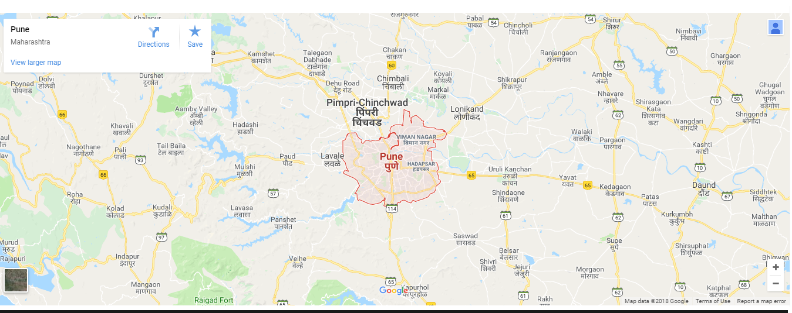

Wordpress Demo Theme
=======
**Contributor:** prathmesh patil.

**Version:** 1.0.0 

## Description ##
  Following are main features this Wordpress Theme:

  *  Upload Header and Footer Logo via theme options.
  *  Upload Contact Details Via theme options.
  *  Upload Social Media Links Via Theme Options.
  *  Upload Google map Via Theme Options.
  *  Upload Copyright Text via theme options.
  *  Update your Social Media Links via Social Media Widgets.
  *  Fully Functional post Slider.

## The demo for this theme can be found here: ##
 https://prathmeshpatil01.000webhostapp.com/

## Installation ##

* Install the theme from the 'Themes' section in your dashboard (Go to `Themes > Add New > Upload`) upload zip file.
* Activate it through the 'Themes' section.

## Screenshots ##

### 1. Home Page

### 2. Dynamic Header Section

### 3. Custom Slider

### 4. Child Pages Of Home Pages

### 5. Google Map Uploaded via Theme Options

### 6. Custom socila Widget

### 7. Theme Option Panel

